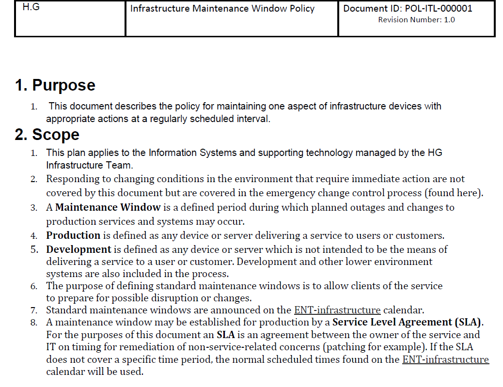
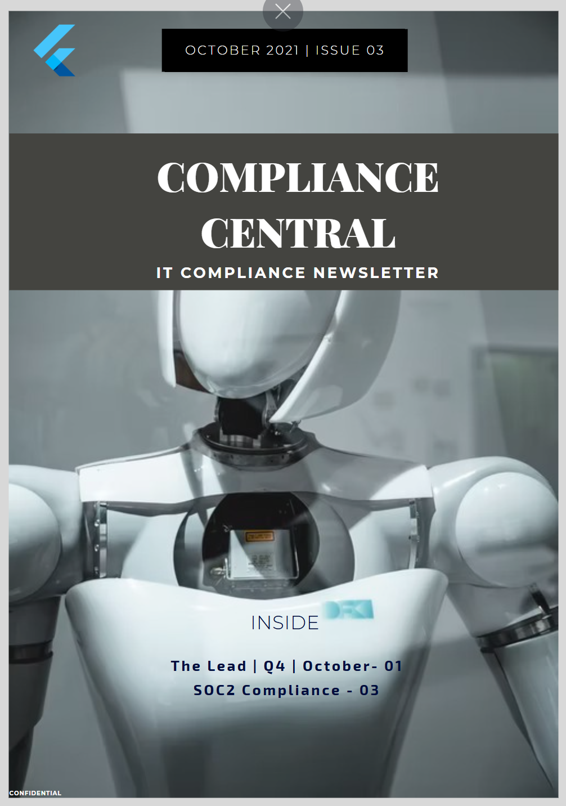

## Developer & systems documentation

### API Documentation

This is a sample newsletter titled "IT Compliance", designed to demonstrate the layout, visual structure, and content tone used for user-facing documentation and updates.  
[👉 Click to view the API Sample](services.md)

---

### Window System Maintenance Policy
This sample systems policy outlines the procedures to follow during maintenance windows required for compliance and audit purposes.  

{ width="200px" height="200px" align="left" } **Tools used**: MS Word, GDoc

[Click to view the sample policy](https://drive.google.com/file/d/1BuEr1xDuIi_K524FhhBqEkehtWtkYzjb/view?usp=drive_link)

--- 

--- 

## User Guides 

I’ve authored 500+ pages of B2B SAAS documentation as a Senior Technical Writer/ Information Developer, solely focused on user-facing and self-help guides. 
My roles included designing and developing release documentation for web and mobile product updates and feature release information. I’ve experience with various content formats, including videos and responsive designs. 

Find samples here:

1. Release update sample
2. Blog 
3. User guide
  

---

## Other user-facing doc samples

### Newsletter
This is a sample newsletter titled "IT Compliance", designed to demonstrate the layout, visual structure, and content tone used for user-facing documentation and updates. 

{ width=200px height=200px align=left } **Tools used**: PDF Generator, Canva, Snagit

[Click to view the Newsletter Sample](https://drive.google.com/file/d/1ve4fbP8WRD79oCeB6D4b3TcGm0phLuPk/view?usp=drive_link)
